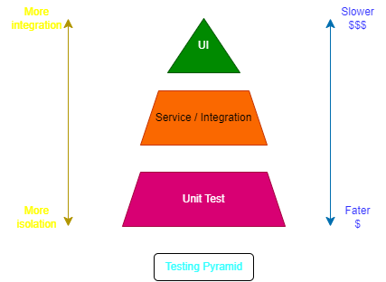
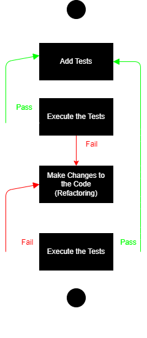

# Introduction to Testing

## Testing

--> It is the process of assessing the completeness and quality of computer software.

--> Usually this is done by running a part of a web application and comparing the actual behavior to the expected behavior.

--> There will be two methods to test the Web Application.

1. Manual Testing:
   --> It is a form of testing done by a human interacting with a system. This will be something like clicking, dragging, and typing through a webpage.

   --> While Testing if the observed behavior does not match the expected heavier, the application has an error.

   --> Errors, like the ones you may have found in the provided web app, are also called bugs. A bug is an error, fault or flaw in software that makes a system behave in unexpected ways

   --> These unexpected behaviors can cause harm to users. Ideally catches bugs before they are sent to users
   -->
   Disadvantages--:
   -->
   --> Manual testing is time-spending because running test cases in everything is done manually.

   --> Human Users (Testers) may make mistakes, so we can not expect more accuracy in Manual Testing

   --> Executing the same tests, again and again, is time taking process as well as Tedious. For every release you must rerun the same set of tests which can tiresome.

2. Automated Testing:
   --> AT is the use of software to control the execution of tests and the comparison of actual behavior to expected behavior

   --> All the testing you just did (and more) could be performed by a computer program

   --> Compared to manual testing, automated testing is:

   1. Faster
   2. More reliable
   3. Maintainable

   --> The workflow might look like this:

   - Write code and corresponding tests
   - enter a command into a terminal to run tests
   - if the app behaves as intended, all test should pass. Development is complete
   - if it does not behave as intended, at least one test should fail. Fix code and return to step 2.

## Why is Testing important?

- Testing gives you confidence in your code.
- its documentation for the developers.
- Refactoring code made easy
- Become a better developer

## Types of Tests (Front-end development perspective)

1. Unit Testing
   --> unit testing is the practice of testing small pieces of code, typically individual functions, alone and isolated.

   --> If your test uses some external resource, like the network or a database, it's not a unit test

   --> Unit tests should be fairly simple to write. A unit tests should essentially just give the function that's tested some inputs, and then check what the function outputs is correct.

   --> When should you use unit testing? Ideally all the time, by applying test-riven development

   --> A good set of unit tests do ot only prevent bugs also improve our code design, and make sure we can later refactor our code without everything completely breaking apart.

2. Integration Testing
   --> As the name suggests, in integration testing the idea is to test how parts of the system work together.

   --> It is similar to unit tests, but there is one big f=difference while unit tests are isolated from other components, integration tests are not.
   For example, a unit test for database access code would not talk to a real database, but integration test would

   --> Integration tests are often slower than unit tests because of the added complexity. They also might need some setup or configuration

   --> You should have fewer integration tests than unit tests. You should mainly use them if you need to to test two separate systems together, or if a piece of code is too complex to unit test

3. E2E Testing (Functional Testing)
   --> Function testing is also sometimes called E2E testing, or browser testing. They all refer to the same thing

   --> It is defined as the testing of complete functionality of some application

   --> In practice with web apps, this means using some tool to automate a browser, which is then used to click around in the pages to test the application

   --> You should use functional tests if you have some repeated tests you do manually in the browser

## Testing Pyramid

## Test-driven Development (TDD)

--> Software development has transitioned from a waterfall to an agile approach over the past decade. Since Agile development involves continuous change. testing became valuable

--> Most developers are familiar with test-driven development, or TDD, but behavior-driven development, or BDD is often misunderstood.

--> TDD is a software development techniques that involves writing automated test cases prior to writing functional pieces of the code.

### Process of TDD

1. A developer, based on requirement documents, writes an automated test case.

2. The development team runs these automated test scripts against what is currently developed and the test fail, as they should since none of the features have been implemented yet.

3. Development team functional code to ensure the automated test script gives them a green light.

4. The development team can then refactor and organize the code to produce a tested deliverable at the end of the script
   
   

5. Mainly TDD refers to write a test case that fails because the specified functionality does not exist and after that update the code that can make the test case pass and as a result we get the feature implement in the system

## Behavior-driven Development (BDD)

--> BDD is a software development technique that defines the user behavior prior to writing test automation scripts or the functional pieces of code.

### Process of BDD

1. The behavior of the user is defined by a product-owner/business-analyst/QA

2. These are then converted to automated scripts to run against functional code

3. The development team then starts writing the functional code to ensure the automated test script gives them a green light

4. The development team can then refactor and organize the code to produce a tested deliverable at the end of the sprint

---

1. BDD is a development technique which focuses more on a software application's behavior.

2. TDD is a development technique which focuses more on the implementation of a feature of a software application/product

3. BDD main focus is on system requirements

4. TDD main focus is on unit tests

---

## JavaScript testing tools/Features

--> A testing framework is a tool or set of tools that helps you perform unit testing

1. Test launchers:
   --> Launch a list of tests based on a configuration you provide (What browsers to run in, what babel plugins to use, how to format the output, etc).

   --> generally Test launchers are used to launch your tests in the browser or in Node.js with user config

2. Test Structures
   --> It refers to the organization of your tests. Nowadays, tests are usually organized in a BDD structure that supports BDD

   --> Testing structure providers help you to arrange your tests in a readable and scalable way

3. Assertion functions:
   --> Assertion functions are used to check if a test returns what you expect it to return and otherwise, to throw a clear exception

4. Spies
   --> Spies are attached to functions to provide extra information about them. For example, how many times a function was called. In which cases, by whom, What arguments were passed to it in each call?

5. Stubbing/ Dubbing / Function Mocking
   --> Mocking Replaces selected methods of existing modules with user-supplied functions in order to ensure expected behavior during the test

6. Generate and compare snapshots to make sure changes to data structures from previous test runs to data structure from previous test runs are intended by the user's code changes. It does not actually renders and takes a picture of the component, but it saves its internal data in a separate file

7. Generate code coverage reports of how much of your code is covered by tests

8. Browser Controllers simulate user actions for E2E Tests

9. Visual Regression Tools are used to compare your site's appearance to its previous versions visually by using image comparison techniques

## JS Testing Frameworks

### Unit Testing Frameworks:-

- Mocha
- Jest
- Jasmine
- Tape
- Qunit

### In order to test we need to have

1. testing structure
2. assertion library
3. how you want to run the tests

---

**_Unit and integration tests can run on the fly, as you code, using "watch mode" because they finish running in seconds. On the other hand E2E tests are usually launched before merges and releases. In some companies it takes hours to finish running all the E2E tests_**

**_Jest is the testing framework created and maintained by Facebook. It was initially based on Jasmine_**

**_Performance- First of all Jest is considered to be faster for big projects with many test files by implementing a clever parallel testing mechanism_**

Jest Provides

- Snapshot testing
- Mocking
- Code coverage

Jasmine is also one of the Testing Framework which supports BDD development just like jest. Has widespread Angular support for all its versions and it is recommended in the official Angular documentation

**_Karma is nothing but a test runner tool. It is the ability to run tests against real browsers and real devices, which makes your testing strategy more robust and reliable_**

### E2E Testing Frameworks:-

E2E tests control browsers and simulate user behavior in the browser (clicking, typing, scrolling etc ...) and make sure these scenarios actually work from the point of view of an end-user

Puppeteer
Playwright
Protractor
WebdriverIO
TestCafe
Cypress
